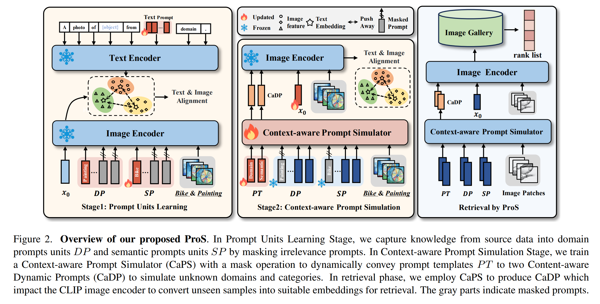

# ProS: Prompting-to-simulate [CVPR2024]

> Official github repository for **ProS: Prompting-to-simulate Generalized knowledge for Universal Cross-Domain Retrieval**. 
> 
> Please refer to [paper link](https://arxiv.org/abs/2312.12478) for detailed information.



## Requirements

- **Ubuntu** 18.04.5 
- **Tesla V100-32GB** ( At least 24GB GPU memory )
- **CUDA**  11.3

Supports for other platforms and hardwares are possible with no warrant. 

## Setups

1. Clone this repository：

``` bash
git clone https://github.com/fangkaipeng/ProS.git
```

2. Install dependencies：

```bash
cd ./ProS
conda env create -f ProS.yaml
conda activate ProS
```

## Data Preparation

1. Download DomainNet, Sketchy and TU-Berlin using scripts in `./ProS/downloads`.

   ``` bash
   cd ./src/downloads
   bash download_domainnet.sh
   bash download_sketchy.sh
   bash download_tuberlin.sh
   ```
   update:
   Google Drive sharing URL for Sketchy and TU-berlin:
   - Sketchy：https://drive.google.com/drive/folders/1IGmRIP826s_aGYq004vbJfyaMGsCmUeD?usp=sharing

   - TU-berlin：https://drive.google.com/drive/folders/1qTEe5DjGdh45UFfGa6Ofy_80yJRp7uI5?usp=sharing
   
3. The directory is expected to be in the structure below:

   ```python
   ├── DomainNet
   │   ├── clipart # images from clipart domain
   │   ├── clipart_test.txt # class names for testing
   │   ├── clipart_train.txt # class names for training
   │   ├── down.sh
   │   ├── infograph
   │   ├── infograph_test.txt
   │   ├── infograph_train.txt
   │   ├── painting
   │   ├── painting_test.txt
   │   ├── painting_train.txt
   │   ├── quickdraw
   │   ├── quickdraw_test.txt
   │   ├── quickdraw_train.txt
   │   ├── real
   │   ├── real_test.txt
   │   ├── real_train.txt
   │   ├── sketch
   │   ├── sketch_test.txt
   │   └── sketch_train.txt
   ├── Sketchy
   │   ├── extended_photo
   │   ├── photo
   │   ├── sketch
   │   └── zeroshot1
   └── TUBerlin
       ├── images
       └── sketches
   ```

## Experiments

### CLIP-Full:

```bash
cd ./src/algos/CLIP-Full
bash reproduce_runs.sh
```

### CoOp and VPT:

```bash
cd ./src/algos/PromptTuning
bash reproduce_runs.sh
```

### ProS:

```bash
cd ./src/algos/ProS
bash reproduce_runs.sh
```

## Citation

Tips: ArXiv version, as it has not yet been officially accepted by CVPR2024.

```
@article{ProS,
  author       = {Kaipeng Fang and
                  Jingkuan Song and
                  Lianli Gao and
                  Pengpeng Zeng and
                  Zhi{-}Qi Cheng and
                  Xiyao Li and
                  Heng Tao Shen},
  title        = {ProS: Prompting-to-simulate Generalized knowledge for Universal Cross-Domain
                  Retrieval},
  journal      = {CoRR},
  year         = {2023},
  doi          = {10.48550/ARXIV.2312.12478},
}
```

## Acknowledgements

Our code implementation is based on this [repo](https://github.com/KaiyangZhou/CoOp).
